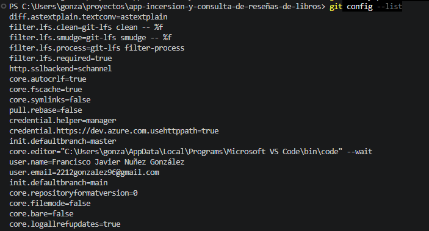
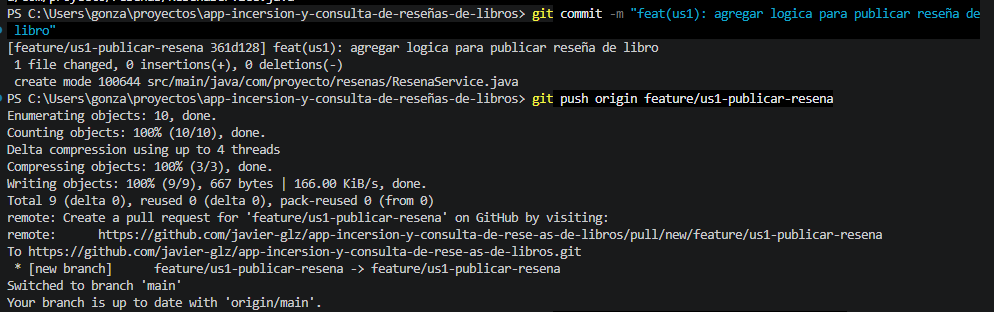
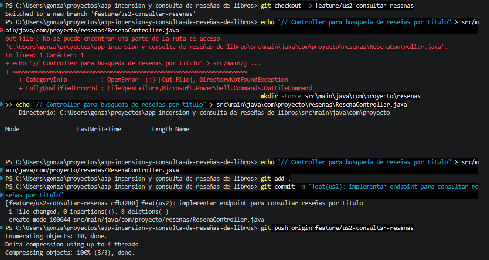
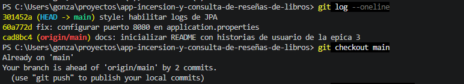
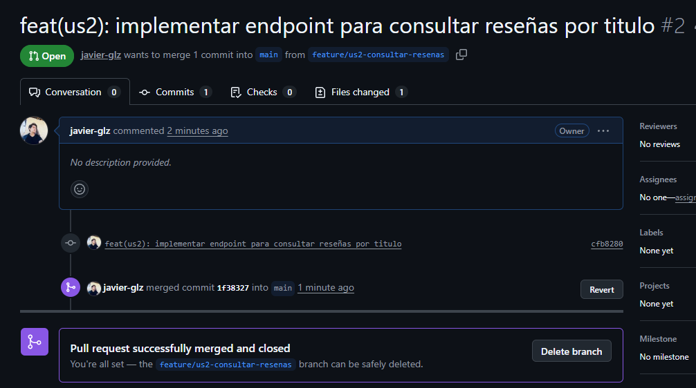

# Épica 3: Plataforma de Inserción y Consulta de Reseñas de Libros

## 📌 Descripción del Proyecto
Este repositorio contiene la definición de Historias de Usuario, arquitectura de repositorio y el flujo de trabajo en Git/GitHub para la implementación de un servicio web donde los lectores pueden publicar y consultar reseñas de libros utilizando Spring Boot, Spring Data JPA y PostgreSQL.

---

## 👥 Justificación de Distribución de Cargas de Trabajo (Trabajo Individual)

Debido a que el desarrollo de esta práctica se realizó de manera **individual**, asumí el rol de **Full-Stack Developer & DevOps Lead**. Para cumplir con la simulación del trabajo colaborativo y la división de ramas en Git, distribuí la carga de trabajo asignando responsabilidades entre roles técnicos simulados:

| Rol Simulado | Responsabilidades Asignadas | Porcentaje de Carga |
| :--- | :--- | :---: |
| **Integrante 1 (Backend Specialist)** | Creación de modelo/entidad JPA, repositorios y servicios para el registro de reseñas. | 40% |
| **Integrante 2 (API Specialist)** | Desarrollo de controladores REST para la consulta de reseñas por título de libro. | 35% |
| **Integrante 3 (DevOps & QA)** | Configuración de `.gitconfig`, gestión de Pull Requests, trazabilidad de commits y documentación. | 25% |

---

## 📖 Historias de Usuario (US)

### US3.1 - Publicar Reseña de Libro
* **Como:** Lector registrado.
* **Quiero:** Publicar una reseña con título, comentario, puntuación (1 al 5) y nombre del autor del libro.
* **Para:** Compartir mi opinión y recomendación con la comunidad de lectores.
* **Criterios de Aceptación:**
  * El título del libro, autor y puntuación son campos obligatorios.
  * La puntuación debe ser un número entero entre 1 y 5.
  * Retornar una respuesta HTTP 201 (Created) al registrar exitosamente.

### US3.2 - Consultar Reseñas por Libro
* **Como:** Visitante de la plataforma.
* **Quiero:** Consultar todas las reseñas asociadas a un libro específico filtrando por su título.
* **Para:** Evaluar las opiniones del público antes de comprar o leer el libro.
* **Criterios de Aceptación:**
  * Permitir la búsqueda por coincidencia de título.
  * Retornar una lista vacía con status HTTP 200 si no se encuentran reseñas registradas.

---

## 📸 Evidencia del Flujo de Trabajo en Git y GitHub

### 1. Configuración de Identidad (.gitconfig)
Se verificó la configuración local del entorno Git mediante las variables globales de usuario y correo.

---

### 2. Flujo de Trabajo en Rama Feature (US3.1)
Creación de la rama `feature/us1-publicar-resena`, estructuración de directorios del módulo de publicación y subida de commits al repositorio remoto.

---

### 3. Flujo de Trabajo en Rama Feature (US3.2)
Creación de la rama `feature/us2-consultar-resenas`, implementación del controlador REST para la búsqueda de reseñas y publicación remota.

---

### 4. Trazabilidad de Commits y Ajuste de Configuración
Registro e inspección de commits específicos dentro del historial del proyecto (`application.properties`).

---

### 5. Fusión Remota (Pull Requests en GitHub)
Aprobación y fusión (*Merge*) de las ramas de características hacia la rama principal `main` desde la interfaz remota de GitHub.

